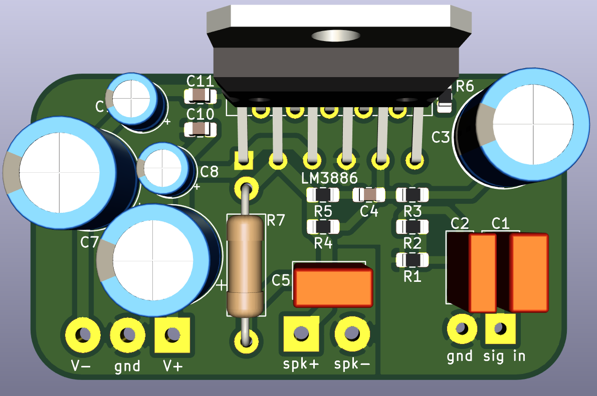
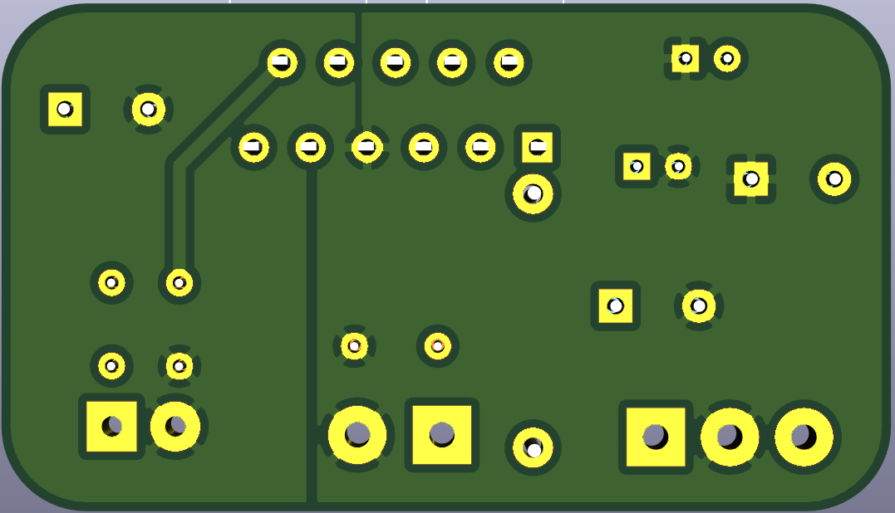

# Evaluation board for LM3886 based chip amps.

 

## Status of the project:

Revision | schematic | pcb layout | built and tested | documentation
---------|-----------|------------|------------------|---------------
1        | &#9745;   | &#9745;    | &#9745;          | &#9745; 
